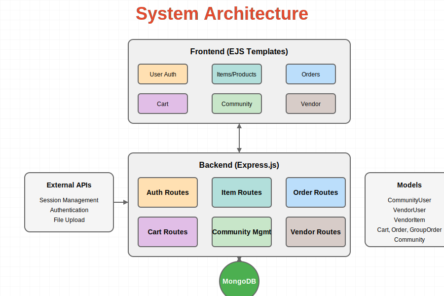

# Community Marketplace System Architecture

## Overview

The Community Marketplace platform is a web application designed to facilitate commerce within communities by connecting local vendors with community members. The system follows a traditional 3-tier architecture with:

1. **Frontend Layer** - EJS Templates
2. **Backend Layer** - Express.js
3. **Database Layer** - MongoDB

## Architecture Diagram



## System Components

### Frontend Layer

The presentation layer uses EJS templating to render dynamic HTML views:

- **User Authentication** - Login, registration, and profile management views
- **Items/Products** - Catalog and product detail pages
- **Orders** - Order history and processing views
- **Cart** - Shopping cart interface
- **Community** - Community management dashboards and interfaces
- **Vendor** - Vendor-specific dashboards and management interfaces

### Backend Layer

The application logic is implemented as an Express.js application with the following key components:

- **Auth Routes** (`authRoutes.js`) - Handles user authentication and registration for both community users and vendors
- **Item Routes** (`communityItems.js`, `vendorItems.js`) - Manages the product catalog and item operations
- **Order Routes** (`communityOrders.js`, `vendorOrders.js`) - Processes order creation and management
- **Cart Routes** (`cartRoutes.js`) - Manages shopping cart operations
- **Community Management** (`communityManagement.js`) - Handles community-specific operations and admin functions
- **Vendor Routes** (`vendorSettings.js`, `vendorAnalytics.js`) - Manages vendor-specific operations

### Database Layer

MongoDB is used as the primary data store with the following models:

- **CommunityUser** - Represents community member accounts with authentication details
- **VendorUser** - Represents vendor accounts with business details
- **VendorItem** - Stores product information including pricing, inventory, and metadata
- **Cart** - Represents user shopping carts with items
- **Order** - Stores completed order information
- **GroupOrder** - Manages bulk/group orders within communities
- **Community** - Stores community information and configuration

### External Integrations

The system integrates with several external services:

- **Session Management** - Uses express-session with MongoStore for persistent sessions
- **Authentication** - Implements secure authentication with bcrypt for password hashing
- **File Upload** - Utilizes multer for handling file uploads (product images, etc.)

## Data Flow

1. User requests are received by the Express.js application server
2. The server processes requests through appropriate route handlers
3. Route handlers interact with MongoDB through Mongoose models
4. The processed data is rendered using EJS templates and sent back to the client

## Security Considerations

- Sessions are secured with HTTP-only cookies
- Passwords are hashed using bcrypt
- CSRF protection is implemented
- Input validation is performed on all user input
- MongoDB connection is secured with retry logic and error handling

## Scalability

The application is designed with scale in mind:

- Database connection pooling for improved performance
- Modular code organization for easier maintenance
- Error handling and logging throughout the application
- Stateless architecture for horizontal scaling potential

## Development Environment

The application can be run locally with:

```bash
npm run dev
```

Additional scripts are available for database maintenance and management in the package.json file. 